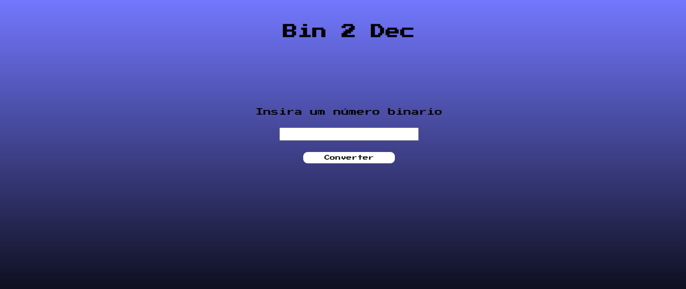
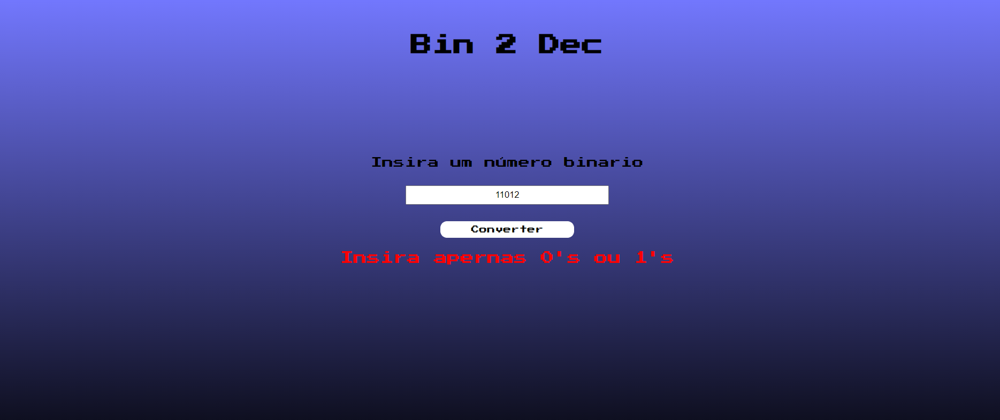
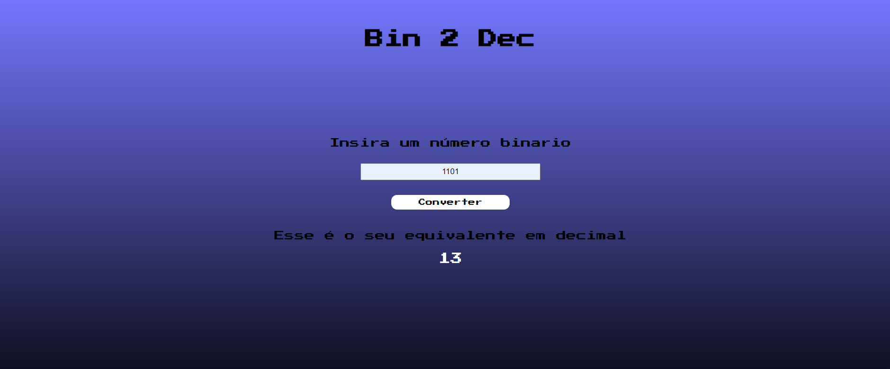

# Bin2Dec

## Sobre o desafio

Esse é um projeto que foi retirado do repositório [App-ideas](https://github.com/florinpop17/app-ideas) para que eu possa praticar minhas habilidades como programador.

**Nível** 1-Iniciante

Binário é o sistema numérico no qual todos os computadores digitais são baseados. Portanto, é importante que os desenvolvedores entendam matemática binária ou de base 2. O objetivo do Bin2Dec é fornecer prática e compreensão de como os cálculos binários.

Bin2Dec permite que o usuário insira strings de até 8 dígitos binários, 0's e 1's, em qualquer sequência e, em seguida, exibe seu equivalente decimal.

Este desafio requer que o desenvolvedor que o está implementando siga estas restrições:

- Arrays não podem ser usadas para conter os dígitos binários inseridos pelo usuário.

- A determinação do equivalente decimal de um dígito binário particular na sequência deve ser calculada usando uma única função matemática, por exemplo, o logaritmo natural. Depende de você descobrir qual função usar.

### User Stories

-  [x] O usuário pode inserir até 8 dígitos binários em um campo de entrada

-  [x] O usuário deve ser notificado se algo diferente de 0 ou 1 foi inserido

-  [x] O usuário visualiza os resultados em um único campo de saída contendo o equivalente decimal (base 10) do número binário que foi inserido

## Minha Experiência

Esse foi o primeiro desafio que resolvi iniciar do [App-ideas](https://github.com/florinpop17/app-ideas). Uma dificildade inicial sobre esse projeto para mim foi decidir como serio o design. Ainda não sou tão bom em desenhar telas.

Eu não sabia como estilar o background então acabei adicionando um degrade com azul e preto para não deixar apenas uma cor solida.

Para a fonte do projeto, como era um conversor de números decimais para números binarios eu queria utilizar uma fonte pixelizada. E a fonte que acabei encontrando foi [Press Start 2P](https://fonts.google.com/specimen/Press+Start+2P?query=press#standard-styles).

Agora falando um pouco sobre o meu código. O primeiro desafio que era poder inserir até 8 digitos no campo de entrada eu resolvi usar a propriedade **maxlenght** do html.

No segundo desafio eu precisava notificar o usuario caso ele colocasse algo diferente de zero ou um, afinal esse conversor é apenas para números decimais para binarios. Então utilizei um regex para fazer a verificação do valor digitado. E caso houvesse algo diferente de 1 ou 0 uma mensagem de erro apareceria. 

Por fim o terceiro desafio, visualizar o resultado da conversão em único campo de saída.

