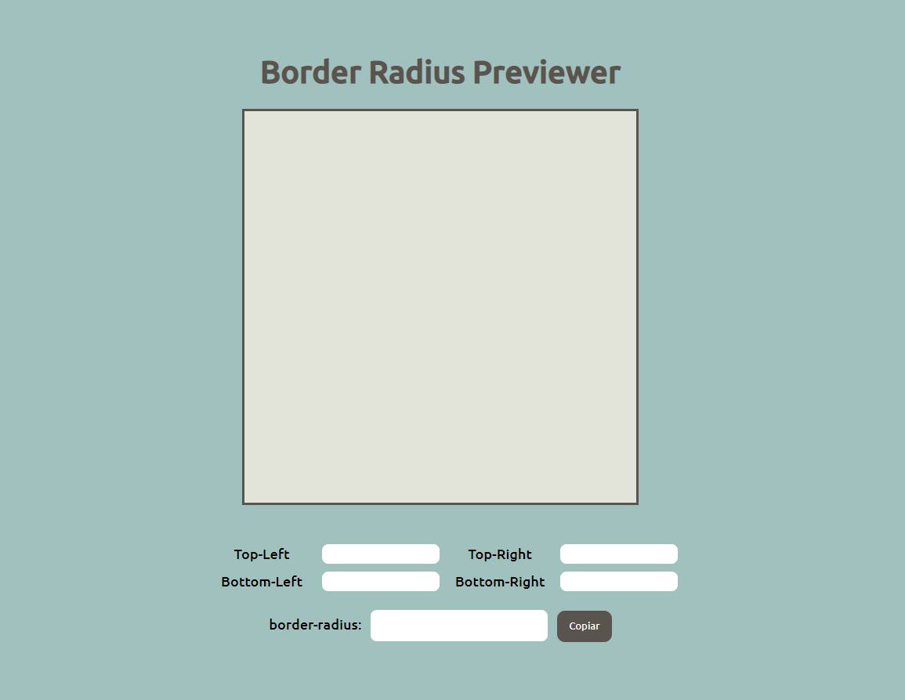

# Border-radius Previewer

Nível: 1-Beginner

A propriedade border-radius pode ter vários valores alterados. Visualize a aparência da forma ao alterar esses valores.

## User Stories
- [x] O usuário pode ver uma caixa que tem uma propriedade border-radius aplicada a ela.
- [x] O usuário pode alterar os 4 valores de raio de borda que são aplicados à caixa (top-left, top-right, bottom-left, bottom-right).
- [x] O usuário pode copiar o CSS resultante para a área de transferência.

