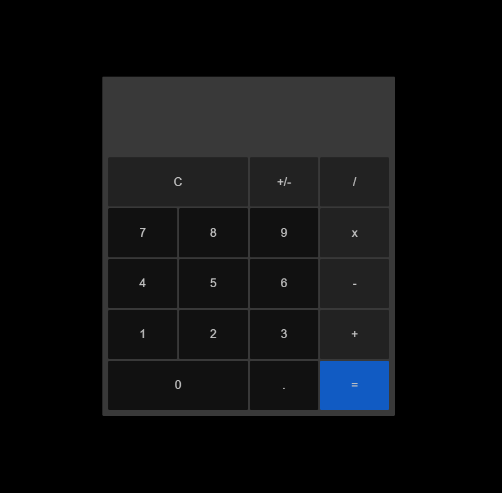

# Calculadora JS

## Sobre o desafio

Esse é um projeto que foi retirado do repositório [App-ideas](https://github.com/florinpop17/app-ideas).

Nesse projeto temos uma calculadora com as 4 operações básicas (soma, subtração, multiplicação e divisão), além de poder mudar o sinal do valor (botão "+/-").

O design desse projeto foi baseado na calculadora do Windows 10.

## Minha evolução

Durante a pesquisa de material para fazer esse projeto consegui aprender a como montar um layout com css grid.

